

# Proyecto 1.1: Obtención y preparación de datos textuales para análisis

## Universidad Tecnológica de la Mixteca

**Maestría en Ingeniería de Software**  
**Alumna:** Ing. Viviana Isabel Salazar Vasquez  
**Profesor:** Dr. Christian Eduardo Millán Hernández  

Huajuapan de León, Oaxaca  
25 de Septiembre 2025

---

## Descripción del proyecto

Este proyecto tiene como objetivo la **recolección, limpieza y preparación de datos textuales** de artículos científicos para su análisis en el área de **Ingeniería de Requisitos y Procesamiento de Lenguaje Natural (PLN)**.

Los artículos se obtuvieron de **arXiv** y sus metadatos se completaron usando la API de **habanero** (Crossref) y, en caso de ser necesario, directamente del PDF.

---

## Fuente y justificación

Se eligieron artículos científicos porque su contenido estructurado y confiable facilita el análisis textual y contribuye directamente al desarrollo del **tema de tesis**.

Cadenas de búsqueda usadas en arXiv:  
- `"nlp" AND "requirements engineering" AND "modeling"`  
- `"use case modeling requirements using nlp"`

---

## Pasos realizados para recolectar los datos

1. **Búsqueda de artículos** en arXiv utilizando las cadenas mencionadas.  
2. **Descarga de PDFs** mediante la API de arXiv.  
3. **Obtención de metadatos** para cada artículo:  
   - Primero, desde arXiv (`arxiv`).  
   - Segundo, desde Crossref (`habanero`) si faltaban metadatos.  
   - Tercero, extracción directa del PDF si faltaba título, autor o fecha.  
4. **Conversión de PDFs a HTML** y extracción de texto limpio.  
5. **Creación de un DataFrame** con todos los metadatos y el texto completo.  
6. **Exportación a CSV** para análisis posterior.

---

## Herramientas y librerías utilizadas

- `arxiv` → búsqueda y descarga de artículos.  
- `habanero` (Crossref) → obtención de metadatos complementarios.  
- `PyMuPDF (fitz)` → manipulación de PDFs y extracción de texto.  
- `re` y `html` de Python → limpieza de texto.  
- `pandas` → organización de datos en DataFrames.  
- `tqdm` → barra de progreso durante la recolección de datos.  

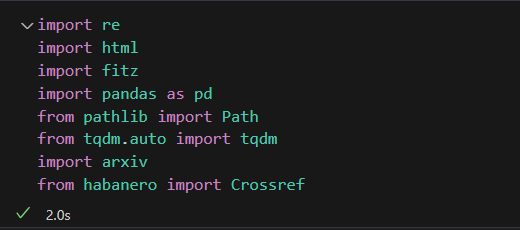
---

# Desarrollo de la práctica:
## Obtención de los datos
- ## Artículos científicos
Carpeta con los archivos pdf:
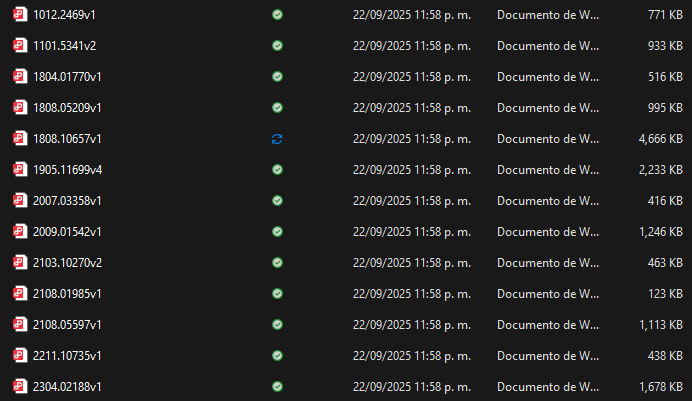

- ## Transformación de los pdfs a html:
1. Se definió los directorios donde se almacenarían los archivos:
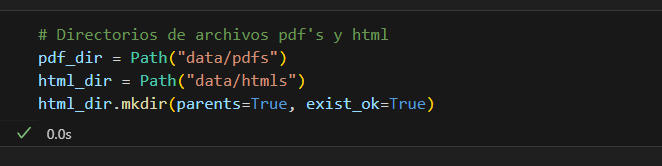
2. Se ejecutó el método para transformar los pdfs a html:
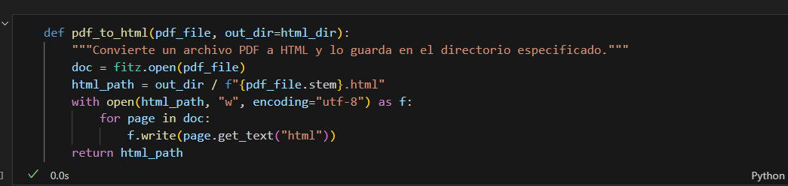
Archivos .html en la carpeta:
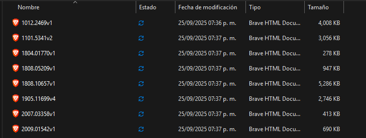

- ## Limpieza de datos:
1. Los datos se limpiaron con la implementación de regex, se establecen en este punto las columnas que tendrá el DataFrame:
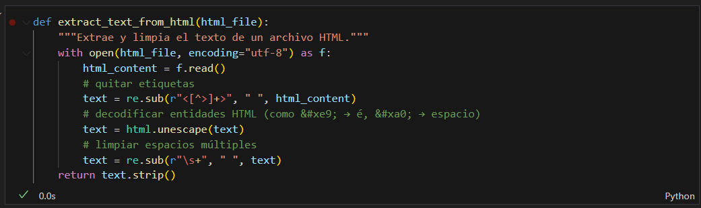
- ## Obtensión de metadatos:
1. Los metadatos se obtienen con ayuda de las APIs de Habanero y Arxiv, en caso de no encontrar un metadato como autor o título lo busca directamente en el texto.
2. El DOI se obtiene principalmente con ayuda de la API de **habanero** 
 
**Metadatos con Arxiv**
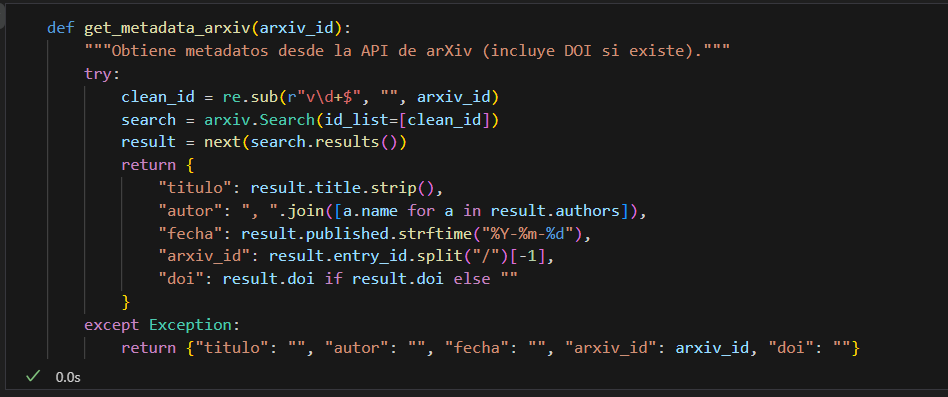
 
**Metadatos con Habanero**
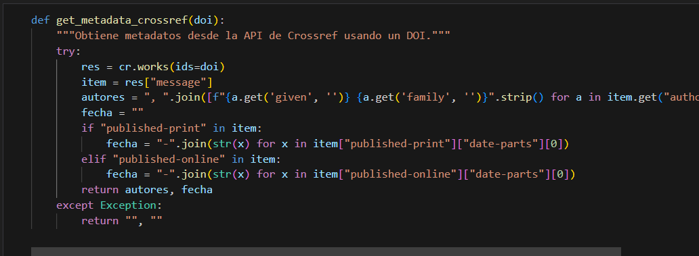
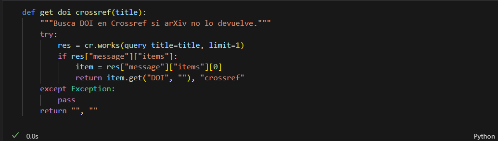
 
**Metadatos del pdf**
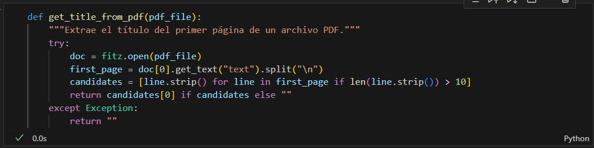

**Aplicación de los métodos para cada archivo pdf**
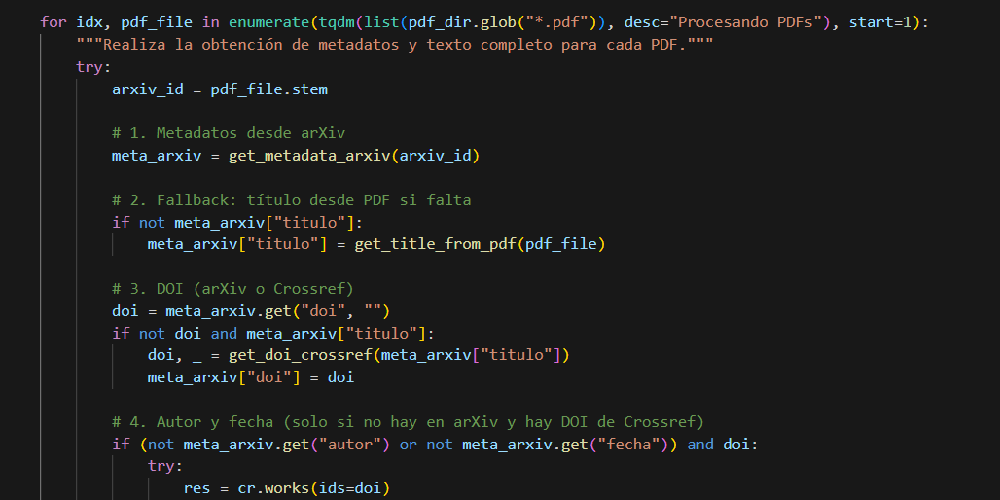
Salida del procesamiento:
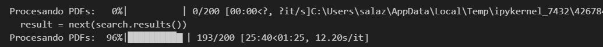

- ## Creación del Data Frame:
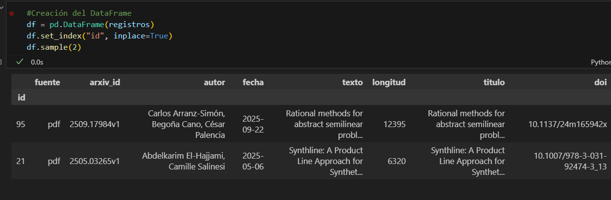

- ## Archivado del Data Frame en CSV
Al Data Frame se almacenó en un archivo .csv a fin de que sea más sencilla su implementación y lectura.
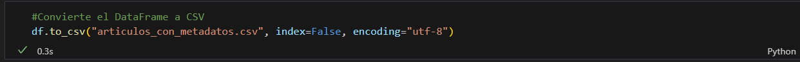
 
**Lectura del csv**
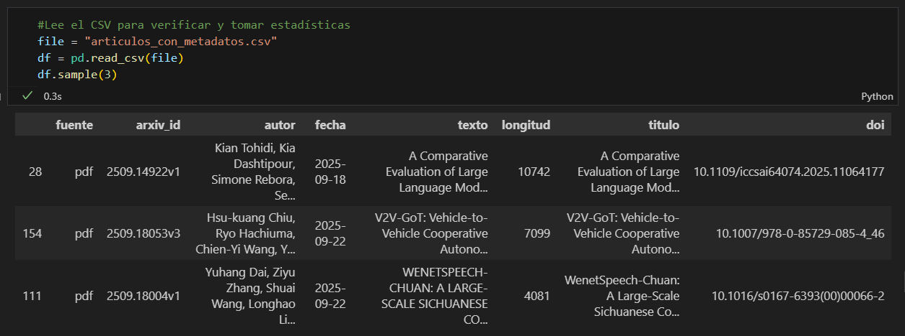

- ## Descripción de los datos:
1. Se describe el número de registros
2. Se muestran las columnas 
3. Se describe el significado de cada columna y los datos que almacena
4. Se dan estadísticas de los datos (mínimo, máximo y promedio de palabras)
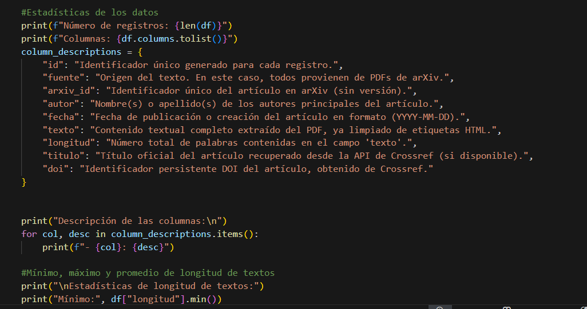
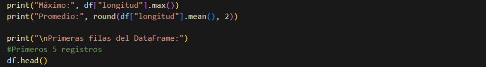

**Salida**

